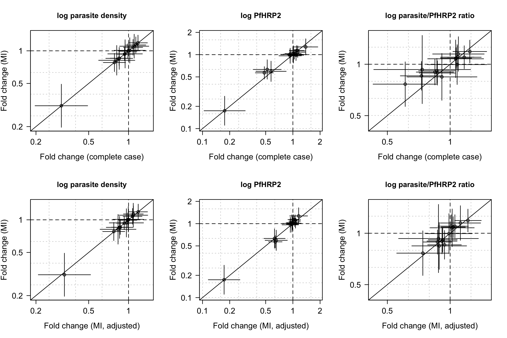
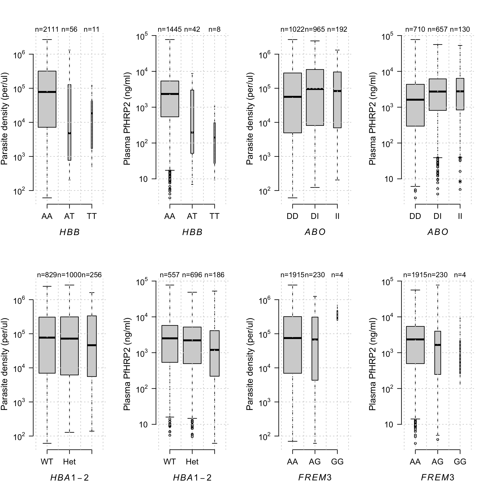
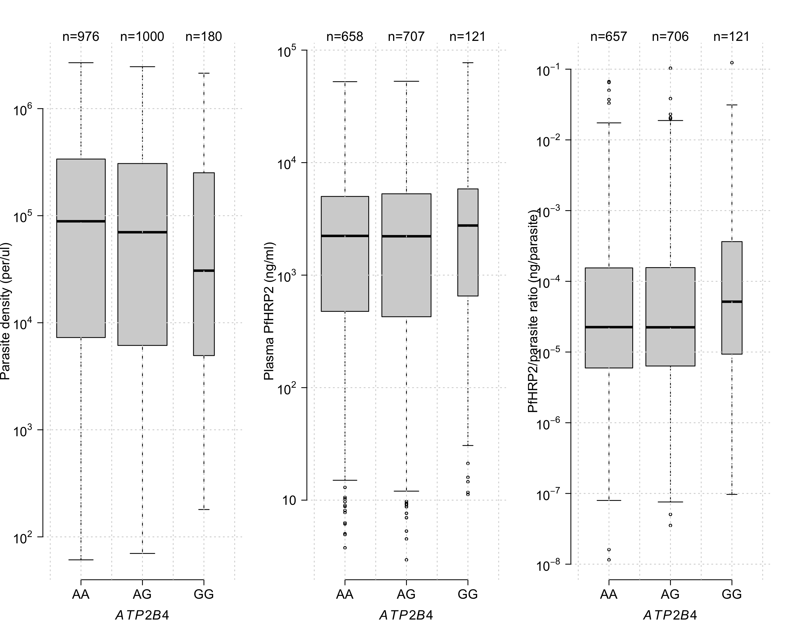
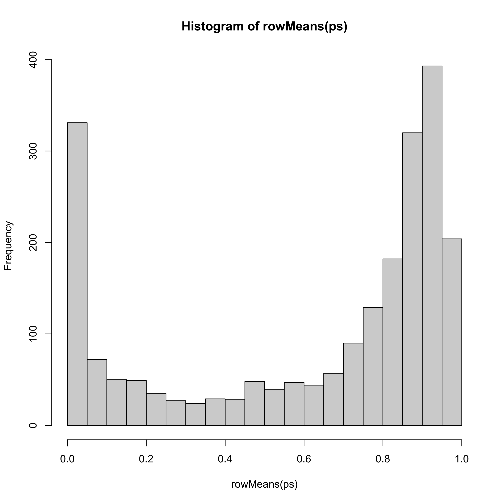
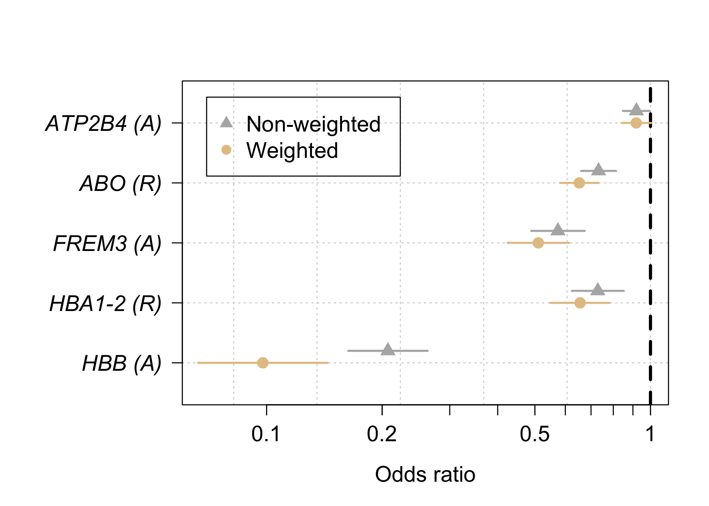
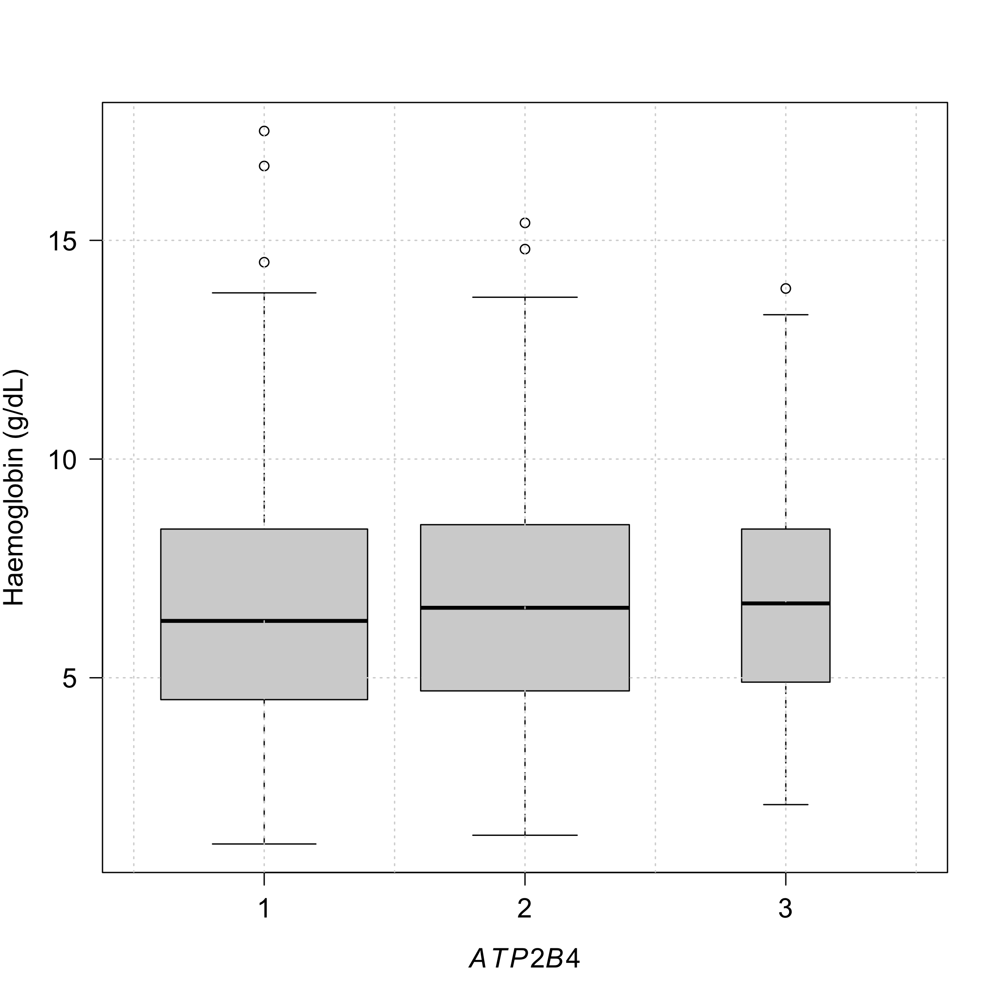

## Load data

Data are also saved as .csv files (one for the cases, one for the controls)


```
## 
## FALSE  TRUE 
##  1500   698
```

```
## 
## FALSE  TRUE 
##  2184    14
```

```
## 
## FALSE  TRUE 
##  1825   373
```


## Compute endpoints

Compute hrp2/parasite ratio (in units of ng/parasite)


##  key polymorphisms


```
## The 14 polymorphisms we use in the analysis are:
```

```
##  [1] "hbb_rs334_num"           "hba1_2"                 
##  [3] "frem3_rs186873296_num"   "abo_rs8176719_num"      
##  [5] "atp2b4_rs1541255_num"    "g6pd_202"               
##  [7] "cd40lg_rs3092945_num"    "rps6kl1_rs3742785_num"  
##  [9] "loc727982_rs1371478_num" "arl14_rs75731597_num"   
## [11] "lphn2_rs72933304_num"    "il10_rs1800890_num"     
## [13] "cand1_rs10459266_num"    "gnas_rs8386_num"
```


## Genotype frequencies


```
##    hbb_rs334 frem3_rs186873296 abo_rs8176719 atp2b4_rs1541255 g6pd_202
## AA      96.9              89.1          47.0             45.4     74.0
## AT       2.6              10.6          44.2             46.3     13.8
## TT       0.5               0.2           8.8              8.3     12.2
##    cd40lg_rs3092945 rps6kl1_rs3742785 loc727982_rs1371478 arl14_rs75731597
## AA             17.1               8.9                49.0             80.7
## AT             17.5              42.2                43.5             18.4
## TT             65.4              48.9                 7.5              0.8
##    lphn2_rs72933304 il10_rs1800890 cand1_rs10459266 gnas_rs8386 hba1_2
## AA              0.4           58.8              5.2        66.5   39.7
## AT             13.5           36.9             34.9        29.6   48.0
## TT             86.1            4.3             59.9         3.9   12.3
```

```
##    hbb_rs334 frem3_rs186873296 abo_rs8176719 atp2b4_rs1541255 g6pd_202
## AA      84.1                82          54.7             44.2     72.7
## AT      15.1                17          38.7             45.1     16.2
## TT       0.8                 1           6.6             10.7     11.1
##    cd40lg_rs3092945 rps6kl1_rs3742785 loc727982_rs1371478 arl14_rs75731597
## AA             13.3               9.6                54.3             84.7
## AT             16.4              38.3                37.5             14.4
## TT             70.3              52.1                 8.2              1.0
##    lphn2_rs72933304 il10_rs1800890 cand1_rs10459266 gnas_rs8386 hba1_2
## AA              0.7           57.5              4.8        65.4   34.4
## AT             15.7           36.0             32.4        31.4   49.5
## TT             83.6            6.5             62.8         3.2   16.1
```


## Case-only association study


Best fitting models. We use single imputation to which is best fitting model


```
## Across all imputations for log_parasites
```

```
##               HBB HBA1-2     FREM3      ABO        ATP2B4 G6PD       CD40LG    
## imputation 1  "A" "R_nodiff" "A_nodiff" "R_nodiff" "A"    "R_nodiff" "H_nodiff"
## imputation 2  "A" "R_nodiff" "A_nodiff" "R_nodiff" "A"    "R_nodiff" "H_nodiff"
## imputation 3  "A" "R_nodiff" "A_nodiff" "R_nodiff" "A"    "R_nodiff" "H_nodiff"
## imputation 4  "A" "R_nodiff" "A_nodiff" "R_nodiff" "A"    "R_nodiff" "H_nodiff"
## imputation 5  "A" "R_nodiff" "A_nodiff" "R_nodiff" "A"    "R_nodiff" "H_nodiff"
## imputation 6  "A" "R_nodiff" "A_nodiff" "R_nodiff" "A"    "R_nodiff" "H_nodiff"
## imputation 7  "A" "R_nodiff" "A_nodiff" "R_nodiff" "A"    "R_nodiff" "H_nodiff"
## imputation 8  "A" "R_nodiff" "A_nodiff" "R_nodiff" "A"    "R_nodiff" "H_nodiff"
## imputation 9  "A" "R_nodiff" "A_nodiff" "R_nodiff" "A"    "R_nodiff" "H_nodiff"
## imputation 10 "A" "R_nodiff" "A_nodiff" "R_nodiff" "A"    "R_nodiff" "H_nodiff"
##               RPS6KL1    LOC727982  ARL14      LPHN2      IL10       CAND1     
## imputation 1  "H_nodiff" "R_nodiff" "A_nodiff" "H_nodiff" "A_nodiff" "A_nodiff"
## imputation 2  "H_nodiff" "R_nodiff" "A_nodiff" "H_nodiff" "A_nodiff" "A_nodiff"
## imputation 3  "H_nodiff" "R_nodiff" "A_nodiff" "H_nodiff" "A_nodiff" "A_nodiff"
## imputation 4  "H_nodiff" "R_nodiff" "A_nodiff" "H_nodiff" "A_nodiff" "A_nodiff"
## imputation 5  "H_nodiff" "R_nodiff" "A_nodiff" "H_nodiff" "A_nodiff" "A_nodiff"
## imputation 6  "H_nodiff" "R_nodiff" "A_nodiff" "H_nodiff" "A_nodiff" "A_nodiff"
## imputation 7  "H_nodiff" "R_nodiff" "A_nodiff" "H_nodiff" "A_nodiff" "A_nodiff"
## imputation 8  "H_nodiff" "R_nodiff" "A_nodiff" "H_nodiff" "A_nodiff" "A_nodiff"
## imputation 9  "H_nodiff" "R_nodiff" "A_nodiff" "H_nodiff" "A_nodiff" "A_nodiff"
## imputation 10 "H_nodiff" "R_nodiff" "A_nodiff" "H_nodiff" "A_nodiff" "A_nodiff"
##               GNAS
## imputation 1  "H" 
## imputation 2  "H" 
## imputation 3  "H" 
## imputation 4  "H" 
## imputation 5  "H" 
## imputation 6  "H" 
## imputation 7  "H" 
## imputation 8  "H" 
## imputation 9  "H" 
## imputation 10 "H"
```

```
## Across all imputations for log_hrp2
```

```
##               HBB HBA1-2 FREM3 ABO ATP2B4     G6PD       CD40LG     RPS6KL1   
## imputation 1  "A" "R"    "A"   "R" "R_nodiff" "H_nodiff" "H"        "A_nodiff"
## imputation 2  "A" "R"    "A"   "R" "H_nodiff" "H_nodiff" "H_nodiff" "A_nodiff"
## imputation 3  "A" "R"    "A"   "R" "H_nodiff" "H_nodiff" "H_nodiff" "A_nodiff"
## imputation 4  "A" "R"    "A"   "R" "R_nodiff" "H_nodiff" "H_nodiff" "A_nodiff"
## imputation 5  "A" "R"    "A"   "R" "R_nodiff" "R_nodiff" "H_nodiff" "A_nodiff"
## imputation 6  "A" "R"    "A"   "R" "R_nodiff" "H_nodiff" "H_nodiff" "A_nodiff"
## imputation 7  "A" "R"    "A"   "R" "R_nodiff" "H_nodiff" "H_nodiff" "A_nodiff"
## imputation 8  "A" "R"    "A"   "R" "R_nodiff" "H_nodiff" "H_nodiff" "A_nodiff"
## imputation 9  "A" "R"    "A"   "R" "R_nodiff" "H_nodiff" "H_nodiff" "A_nodiff"
## imputation 10 "A" "R"    "A"   "R" "R_nodiff" "H_nodiff" "H_nodiff" "A_nodiff"
##               LOC727982  ARL14      LPHN2      IL10       CAND1      GNAS      
## imputation 1  "A_nodiff" "R_nodiff" "H_nodiff" "R_nodiff" "R_nodiff" "H_nodiff"
## imputation 2  "A_nodiff" "R_nodiff" "R_nodiff" "A_nodiff" "R_nodiff" "H_nodiff"
## imputation 3  "A_nodiff" "R_nodiff" "H_nodiff" "A_nodiff" "R_nodiff" "H_nodiff"
## imputation 4  "A_nodiff" "R_nodiff" "H_nodiff" "R_nodiff" "R_nodiff" "H_nodiff"
## imputation 5  "A_nodiff" "R_nodiff" "H_nodiff" "A_nodiff" "R_nodiff" "H_nodiff"
## imputation 6  "A_nodiff" "R_nodiff" "H_nodiff" "A_nodiff" "R_nodiff" "H_nodiff"
## imputation 7  "A_nodiff" "R_nodiff" "H_nodiff" "A_nodiff" "R_nodiff" "H_nodiff"
## imputation 8  "A_nodiff" "R_nodiff" "H_nodiff" "A_nodiff" "R_nodiff" "H_nodiff"
## imputation 9  "A_nodiff" "R_nodiff" "H_nodiff" "A_nodiff" "R_nodiff" "H_nodiff"
## imputation 10 "A_nodiff" "R_nodiff" "H_nodiff" "A_nodiff" "R_nodiff" "H_nodiff"
```

```
## Across all imputations for log_ratio
```

```
##               HBB        HBA1-2     FREM3      ABO        ATP2B4 G6PD      
## imputation 1  "R_nodiff" "R_nodiff" "A_nodiff" "R_nodiff" "R"    "R_nodiff"
## imputation 2  "R_nodiff" "R_nodiff" "A_nodiff" "R_nodiff" "R"    "R_nodiff"
## imputation 3  "R_nodiff" "R_nodiff" "A_nodiff" "R_nodiff" "R"    "R_nodiff"
## imputation 4  "R_nodiff" "R_nodiff" "A_nodiff" "R_nodiff" "R"    "R_nodiff"
## imputation 5  "R_nodiff" "R_nodiff" "A_nodiff" "R_nodiff" "R"    "R_nodiff"
## imputation 6  "R_nodiff" "R_nodiff" "A_nodiff" "R_nodiff" "R"    "R_nodiff"
## imputation 7  "R_nodiff" "R_nodiff" "A_nodiff" "R_nodiff" "R"    "R_nodiff"
## imputation 8  "R_nodiff" "R_nodiff" "A_nodiff" "R_nodiff" "R"    "R_nodiff"
## imputation 9  "R_nodiff" "R_nodiff" "A_nodiff" "R_nodiff" "R"    "R_nodiff"
## imputation 10 "R_nodiff" "R_nodiff" "A_nodiff" "R_nodiff" "R"    "R_nodiff"
##               CD40LG     RPS6KL1    LOC727982  ARL14      LPHN2      IL10      
## imputation 1  "H_nodiff" "H_nodiff" "R_nodiff" "R_nodiff" "H_nodiff" "A_nodiff"
## imputation 2  "H_nodiff" "H_nodiff" "R_nodiff" "R_nodiff" "R_nodiff" "A_nodiff"
## imputation 3  "H_nodiff" "H_nodiff" "R_nodiff" "R_nodiff" "R_nodiff" "A_nodiff"
## imputation 4  "H_nodiff" "H_nodiff" "R_nodiff" "R_nodiff" "A_nodiff" "A_nodiff"
## imputation 5  "H_nodiff" "H_nodiff" "R_nodiff" "R_nodiff" "H_nodiff" "A_nodiff"
## imputation 6  "H_nodiff" "H_nodiff" "R_nodiff" "R_nodiff" "H_nodiff" "A_nodiff"
## imputation 7  "H_nodiff" "H_nodiff" "R_nodiff" "R_nodiff" "H_nodiff" "A_nodiff"
## imputation 8  "H_nodiff" "H_nodiff" "R_nodiff" "R_nodiff" "H_nodiff" "A_nodiff"
## imputation 9  "H_nodiff" "H_nodiff" "R_nodiff" "R_nodiff" "R_nodiff" "A_nodiff"
## imputation 10 "H_nodiff" "H_nodiff" "R_nodiff" "R_nodiff" "H_nodiff" "A_nodiff"
##               CAND1      GNAS      
## imputation 1  "A_nodiff" "H_nodiff"
## imputation 2  "A_nodiff" "H_nodiff"
## imputation 3  "A_nodiff" "H_nodiff"
## imputation 4  "A_nodiff" "H_nodiff"
## imputation 5  "A_nodiff" "H_nodiff"
## imputation 6  "A_nodiff" "H_nodiff"
## imputation 7  "A_nodiff" "H_nodiff"
## imputation 8  "A_nodiff" "H_nodiff"
## imputation 9  "A_nodiff" "H_nodiff"
## imputation 10 "A_nodiff" "H_nodiff"
```

```
##        HBB     HBA1-2      FREM3        ABO     ATP2B4       G6PD     CD40LG 
##        "A"        "R"        "A"        "R" "R_nodiff" "H_nodiff"        "H" 
##    RPS6KL1  LOC727982      ARL14      LPHN2       IL10      CAND1       GNAS 
## "A_nodiff" "A_nodiff" "R_nodiff" "H_nodiff" "R_nodiff" "R_nodiff" "H_nodiff"
```

```
## [1] FALSE
```

# Case-only analysis

## Multiple imputation analysis

Estimate effects using multiple imputation - this is the main analysis underlying reported effects.


```
## ******* Analysis for hbb_rs334_num polymorphism
## For log_parasites model p=5.8e-07
## For log_hrp2 model p=3.64e-14
## For log_ratio model p=0.761
## ******* Analysis for hba1_2 polymorphism
## For log_parasites model p=0.672
## For log_hrp2 model p=0.00271
## For log_ratio model p=0.0802
## ******* Analysis for frem3_rs186873296_num polymorphism
## For log_parasites model p=0.21
## For log_hrp2 model p=0.00125
## For log_ratio model p=0.289
## ******* Analysis for abo_rs8176719_num polymorphism
## For log_parasites model p=0.0116
## For log_hrp2 model p=7.53e-09
## For log_ratio model p=0.113
## ******* Analysis for atp2b4_rs1541255_num polymorphism
## For log_parasites model p=0.0447
## For log_hrp2 model p=0.854
## For log_ratio model p=0.0283
## ******* Analysis for g6pd_202 polymorphism
## For log_parasites model p=0.322
## For log_hrp2 model p=0.846
## For log_ratio model p=0.248
## ******* Analysis for cd40lg_rs3092945_num polymorphism
## For log_parasites model p=0.45
## For log_hrp2 model p=0.0641
## For log_ratio model p=0.571
## ******* Analysis for rps6kl1_rs3742785_num polymorphism
## For log_parasites model p=0.97
## For log_hrp2 model p=0.102
## For log_ratio model p=0.223
## ******* Analysis for loc727982_rs1371478_num polymorphism
## For log_parasites model p=0.918
## For log_hrp2 model p=0.136
## For log_ratio model p=0.233
## ******* Analysis for arl14_rs75731597_num polymorphism
## For log_parasites model p=0.179
## For log_hrp2 model p=0.762
## For log_ratio model p=0.246
## ******* Analysis for lphn2_rs72933304_num polymorphism
## For log_parasites model p=0.945
## For log_hrp2 model p=0.959
## For log_ratio model p=0.974
## ******* Analysis for il10_rs1800890_num polymorphism
## For log_parasites model p=0.382
## For log_hrp2 model p=0.848
## For log_ratio model p=0.301
## ******* Analysis for cand1_rs10459266_num polymorphism
## For log_parasites model p=0.0417
## For log_hrp2 model p=0.356
## For log_ratio model p=0.157
## ******* Analysis for gnas_rs8386_num polymorphism
## For log_parasites model p=0.161
## For log_hrp2 model p=0.743
## For log_ratio model p=0.231
```


```
## Effects for log_parasites
##               Estimate upperCI lowerCI
## CD40LG (H)        1.10    0.86    1.40
## RPS6KL1 (A)       1.00    0.85    1.20
## LOC727982 (A)     0.99    0.85    1.20
## CAND1 (A)         1.20    1.00    1.40
## GNAS (A)          1.10    0.95    1.30
## ATP2B4 (A)        0.85    0.73    1.00
## G6PD (A)          0.93    0.81    1.10
## LPHN2 (A)         1.00    0.77    1.30
## IL10 (A)          1.10    0.91    1.30
## ARL14 (A)         0.85    0.67    1.10
## HBA1-2 (R)        0.94    0.69    1.30
## FREM3 (A)         0.82    0.60    1.10
## ABO (R)           0.78    0.64    0.95
## HBB (A)           0.31    0.20    0.49
## Effects for log_hrp2
##               Estimate upperCI lowerCI
## CD40LG (H)        1.30    0.99    1.60
## RPS6KL1 (A)       1.10    0.97    1.30
## LOC727982 (A)     1.10    0.96    1.30
## CAND1 (A)         1.10    0.92    1.30
## GNAS (A)          1.00    0.87    1.20
## ATP2B4 (A)        1.00    0.87    1.20
## G6PD (A)          1.00    0.88    1.20
## LPHN2 (A)         1.00    0.77    1.30
## IL10 (A)          0.98    0.83    1.20
## ARL14 (A)         0.96    0.76    1.20
## HBA1-2 (R)        0.63    0.47    0.85
## FREM3 (A)         0.59    0.43    0.82
## ABO (R)           0.57    0.47    0.69
## HBB (A)           0.17    0.11    0.27
## Effects for log_ratio
##               Estimate upperCI lowerCI
## CD40LG (H)        1.10    0.83     1.4
## RPS6KL1 (A)       1.10    0.94     1.3
## LOC727982 (A)     1.10    0.94     1.3
## CAND1 (A)         0.89    0.75     1.0
## GNAS (A)          0.90    0.76     1.1
## ATP2B4 (A)        1.20    1.00     1.4
## G6PD (A)          1.10    0.94     1.2
## LPHN2 (A)         1.00    0.76     1.3
## IL10 (A)          0.92    0.77     1.1
## ARL14 (A)         1.10    0.91     1.4
## HBA1-2 (R)        0.76    0.57     1.0
## FREM3 (A)         0.84    0.61     1.2
## ABO (R)           0.86    0.70     1.0
## HBB (A)           0.93    0.59     1.5
```


## Complete case analysis


```
## ******* Analysis for hbb_rs334_num polymorphism
## For log_parasites model p=6.09835421288473e-07
## For log_hrp2 model p=1.17530538078478e-10
## For log_ratio model p=0.258587493066735
## ******* Analysis for hba1_2 polymorphism
## For log_parasites model p=0.696438471095131
## For log_hrp2 model p=0.00031814351950014
## For log_ratio model p=0.00629041532293178
## ******* Analysis for frem3_rs186873296_num polymorphism
## For log_parasites model p=0.202043752475078
## For log_hrp2 model p=0.00483377488554595
## For log_ratio model p=0.644738841251556
## ******* Analysis for abo_rs8176719_num polymorphism
## For log_parasites model p=0.0131268621605838
## For log_hrp2 model p=7.94045743533939e-10
## For log_ratio model p=0.00789680319739409
## ******* Analysis for atp2b4_rs1541255_num polymorphism
## For log_parasites model p=0.0365547665148183
## For log_hrp2 model p=0.683465972091446
## For log_ratio model p=0.0227050400637977
## ******* Analysis for g6pd_202 polymorphism
## For log_parasites model p=0.334060332605031
## For log_hrp2 model p=0.392109058378897
## For log_ratio model p=0.451036782038497
## ******* Analysis for cd40lg_rs3092945_num polymorphism
## For log_parasites model p=0.45162926332164
## For log_hrp2 model p=0.0377943261243058
## For log_ratio model p=0.699784481657525
## ******* Analysis for rps6kl1_rs3742785_num polymorphism
## For log_parasites model p=0.917793585975565
## For log_hrp2 model p=0.316926457731408
## For log_ratio model p=0.401623870106487
## ******* Analysis for loc727982_rs1371478_num polymorphism
## For log_parasites model p=0.901025995467101
## For log_hrp2 model p=0.19524213647913
## For log_ratio model p=0.105254839058619
## ******* Analysis for arl14_rs75731597_num polymorphism
## For log_parasites model p=0.176876774434853
## For log_hrp2 model p=0.63689574957587
## For log_ratio model p=0.529945911503966
## ******* Analysis for lphn2_rs72933304_num polymorphism
## For log_parasites model p=0.877354000311971
## For log_hrp2 model p=0.926500884900159
## For log_ratio model p=0.644006985186236
## ******* Analysis for il10_rs1800890_num polymorphism
## For log_parasites model p=0.35520570614171
## For log_hrp2 model p=0.435214701782955
## For log_ratio model p=0.157306526974136
## ******* Analysis for cand1_rs10459266_num polymorphism
## For log_parasites model p=0.0501273145701642
## For log_hrp2 model p=0.231894440507826
## For log_ratio model p=0.168956190888501
## ******* Analysis for gnas_rs8386_num polymorphism
## For log_parasites model p=0.152117866523227
## For log_hrp2 model p=0.973668078126477
## For log_ratio model p=0.110265714565
```


```
## Effects for log_parasites
##               Estimate upperCI lowerCI
## CD40LG (H)        1.10    0.85    1.40
## RPS6KL1 (A)       0.99    0.85    1.20
## LOC727982 (A)     0.99    0.85    1.20
## CAND1 (A)         1.20    1.00    1.40
## GNAS (A)          1.10    0.95    1.40
## ATP2B4 (A)        0.85    0.73    0.99
## G6PD (A)          0.93    0.81    1.10
## LPHN2 (A)         1.00    0.78    1.30
## IL10 (A)          1.10    0.92    1.30
## ARL14 (A)         0.85    0.67    1.10
## HBA1-2 (R)        0.94    0.70    1.30
## FREM3 (A)         0.81    0.59    1.10
## ABO (R)           0.78    0.64    0.95
## HBB (A)           0.31    0.20    0.49
## Effects for log_hrp2
##               Estimate upperCI lowerCI
## CD40LG (H)        1.40    1.00    1.90
## RPS6KL1 (A)       1.10    0.91    1.30
## LOC727982 (A)     1.10    0.94    1.40
## CAND1 (A)         1.10    0.92    1.40
## GNAS (A)          1.00    0.82    1.20
## ATP2B4 (A)        1.00    0.86    1.30
## G6PD (A)          0.93    0.78    1.10
## LPHN2 (A)         1.00    0.73    1.40
## IL10 (A)          1.10    0.89    1.30
## ARL14 (A)         0.93    0.70    1.20
## HBA1-2 (R)        0.52    0.36    0.74
## FREM3 (A)         0.57    0.39    0.84
## ABO (R)           0.48    0.38    0.61
## HBB (A)           0.18    0.10    0.30
## Effects for log_ratio
##               Estimate upperCI lowerCI
## CD40LG (H)        1.10    0.78    1.40
## RPS6KL1 (A)       1.10    0.90    1.30
## LOC727982 (A)     1.20    0.97    1.40
## CAND1 (A)         0.87    0.71    1.10
## GNAS (A)          0.85    0.69    1.00
## ATP2B4 (A)        1.20    1.00    1.50
## G6PD (A)          1.10    0.90    1.30
## LPHN2 (A)         1.10    0.78    1.50
## IL10 (A)          0.86    0.71    1.10
## ARL14 (A)         1.10    0.82    1.50
## HBA1-2 (R)        0.61    0.43    0.87
## FREM3 (A)         0.91    0.62    1.30
## ABO (R)           0.73    0.58    0.92
## HBB (A)           0.73    0.43    1.30
```

Estimate effects with additional adjustment for:

* age
* bacteriaemia
* haemoglobin


```
## ******* Analysis for hbb_rs334_num polymorphism
## For log_parasites model p=1.54e-06
## For log_hrp2 model p=1.59e-17
## For log_ratio model p=0.567
## ******* Analysis for hba1_2 polymorphism
## For log_parasites model p=0.807
## For log_hrp2 model p=0.000731
## For log_ratio model p=0.0404
## ******* Analysis for frem3_rs186873296_num polymorphism
## For log_parasites model p=0.252
## For log_hrp2 model p=0.0034
## For log_ratio model p=0.435
## ******* Analysis for abo_rs8176719_num polymorphism
## For log_parasites model p=0.00874
## For log_hrp2 model p=4.05e-07
## For log_ratio model p=0.513
## ******* Analysis for atp2b4_rs1541255_num polymorphism
## For log_parasites model p=0.0633
## For log_hrp2 model p=0.345
## For log_ratio model p=0.00891
## ******* Analysis for g6pd_202 polymorphism
## For log_parasites model p=0.288
## For log_hrp2 model p=0.353
## For log_ratio model p=0.62
## ******* Analysis for cd40lg_rs3092945_num polymorphism
## For log_parasites model p=0.523
## For log_hrp2 model p=0.207
## For log_ratio model p=0.857
## ******* Analysis for rps6kl1_rs3742785_num polymorphism
## For log_parasites model p=0.964
## For log_hrp2 model p=0.864
## For log_ratio model p=0.869
## ******* Analysis for loc727982_rs1371478_num polymorphism
## For log_parasites model p=0.884
## For log_hrp2 model p=0.432
## For log_ratio model p=0.49
## ******* Analysis for arl14_rs75731597_num polymorphism
## For log_parasites model p=0.186
## For log_hrp2 model p=0.548
## For log_ratio model p=0.319
## ******* Analysis for lphn2_rs72933304_num polymorphism
## For log_parasites model p=0.974
## For log_hrp2 model p=0.845
## For log_ratio model p=0.922
## ******* Analysis for il10_rs1800890_num polymorphism
## For log_parasites model p=0.413
## For log_hrp2 model p=0.843
## For log_ratio model p=0.316
## ******* Analysis for cand1_rs10459266_num polymorphism
## For log_parasites model p=0.0421
## For log_hrp2 model p=0.544
## For log_ratio model p=0.0815
## ******* Analysis for gnas_rs8386_num polymorphism
## For log_parasites model p=0.339
## For log_hrp2 model p=0.952
## For log_ratio model p=0.291
```


## Figure 1 (main result)

<!-- -->

## Figure 1 (complete case)

<!-- -->


## Comparison complete case vs imputation

<!-- -->


## Type of model

Best fitting model for the main polymorphisms using complete data only


```
## [1] "hbb_rs334_num"
## Likelihood ratio test
## 
## Model 1: log_hrp2 ~ g
## Model 2: log_hrp2 ~ g
## Model 3: log_hrp2 ~ g
##   #Df  LogLik Df  Chisq Pr(>Chisq)    
## 1   3 -1796.3                         
## 2   3 -1811.0  0 29.479  < 2.2e-16 ***
## 3   3 -1804.0  0 14.091  < 2.2e-16 ***
## ---
## Signif. codes:  0 '***' 0.001 '**' 0.01 '*' 0.05 '.' 0.1 ' ' 1
## [1] "hba1_2"
## Likelihood ratio test
## 
## Model 1: log_hrp2 ~ g
## Model 2: log_hrp2 ~ g
## Model 3: log_hrp2 ~ g
##   #Df  LogLik Df   Chisq Pr(>Chisq)    
## 1   3 -1762.6                          
## 2   3 -1761.1  0  2.9915  < 2.2e-16 ***
## 3   3 -1767.5  0 12.8384  < 2.2e-16 ***
## ---
## Signif. codes:  0 '***' 0.001 '**' 0.01 '*' 0.05 '.' 0.1 ' ' 1
## [1] "frem3_rs186873296_num"
## Likelihood ratio test
## 
## Model 1: log_hrp2 ~ g
## Model 2: log_hrp2 ~ g
## Model 3: log_hrp2 ~ g
##   #Df  LogLik Df  Chisq Pr(>Chisq)   
## 1   3 -1805.0                        
## 2   2 -1809.1 -1 8.1317    0.00435 **
## 3   3 -1805.0  1 8.1317    0.00435 **
## ---
## Signif. codes:  0 '***' 0.001 '**' 0.01 '*' 0.05 '.' 0.1 ' ' 1
## [1] "abo_rs8176719_num"
## Likelihood ratio test
## 
## Model 1: log_hrp2 ~ g
## Model 2: log_hrp2 ~ g
## Model 3: log_hrp2 ~ g
##   #Df  LogLik Df  Chisq Pr(>Chisq)    
## 1   3 -1813.2                         
## 2   3 -1809.3  0 7.7881  < 2.2e-16 ***
## 3   3 -1814.1  0 9.5403  < 2.2e-16 ***
## ---
## Signif. codes:  0 '***' 0.001 '**' 0.01 '*' 0.05 '.' 0.1 ' ' 1
## [1] "atp2b4_rs1541255_num"
## Likelihood ratio test
## 
## Model 1: log_hrp2 ~ g
## Model 2: log_hrp2 ~ g
## Model 3: log_hrp2 ~ g
##   #Df  LogLik Df  Chisq Pr(>Chisq)    
## 1   3 -1817.2                         
## 2   3 -1816.5  0 1.4114  < 2.2e-16 ***
## 3   3 -1816.9  0 0.7494  < 2.2e-16 ***
## ---
## Signif. codes:  0 '***' 0.001 '**' 0.01 '*' 0.05 '.' 0.1 ' ' 1
```


## Boxplots
### Red cell polymorphisms

<!-- -->


### ATP2B4


<!-- -->

## Relationship with true severe malaria


<!-- -->


data tilting case-control

```
## Doing hbb_rs334_num
## log10 weighted p-value is -31.1034486453982
## log10 non-weighted p-value is -37.7818996998084
## Doing hba1_2
## log10 weighted p-value is -5.52427515957124
## log10 non-weighted p-value is -4.16336276635852
## Doing frem3_rs186873296_num
## log10 weighted p-value is -12.1216786211662
## log10 non-weighted p-value is -10.9532600611397
## Doing abo_rs8176719_num
## log10 weighted p-value is -12.2858222070892
## log10 non-weighted p-value is -8.20013388974944
## Doing atp2b4_rs1541255_num
## log10 weighted p-value is -1.23423058744057
## log10 non-weighted p-value is -1.38527803603474
```


<!-- -->


<!-- -->


## ATP2B4 and haemoglobin


<!-- -->


