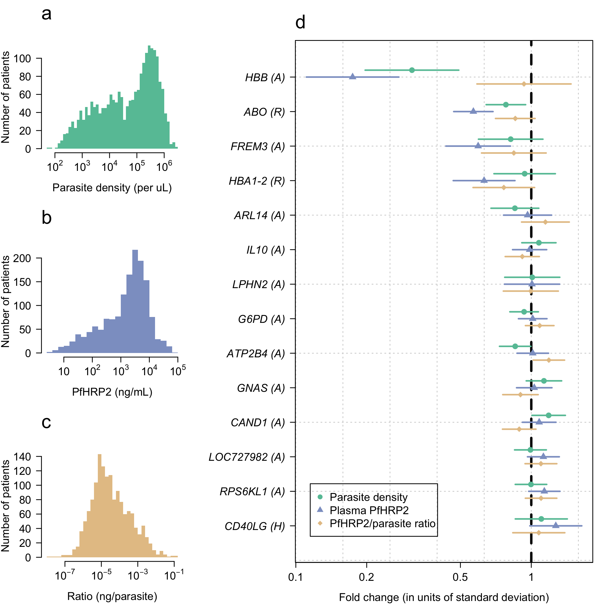

# Parasite_biomass

This github repo provides code and data to reproduce the results in ["The impact of malaria-protective red blood cell polymorphisms on parasite biomass in children with severe Plasmodium falciparum malaria"](https://www.medrxiv.org/content/10.1101/2022.02.21.22271267v1) by Uyoga et al (preprint).

This is a genetic case-only association study which uses parasite biomass as measured by the plasma concentration of PfHRP2 as a quantitative phenotype.

The raw data are given in the files *kemri_case_data.csv* (cases) and *kemri_control_data.csv* (controls). All the analysis can be reproduced by running the RMarkdown file *PfHRP2_quantitative_trait.Rmd*. This uses the following R packges:

* *mitools* (combine analyses on multiple imputation datasets)
* *rstan* (extract posterior samples from previously run model)
* *mvtnorm* (multivariate normal)
* *matrixStats* (useful functions such as logsumexp)

The main result compares the associations estimated in case-only analyses with three quantitative traits:

* peripheral parasite density
* plasma PfHRP2 concentration
* ratio of PfHRP2/parasite density

